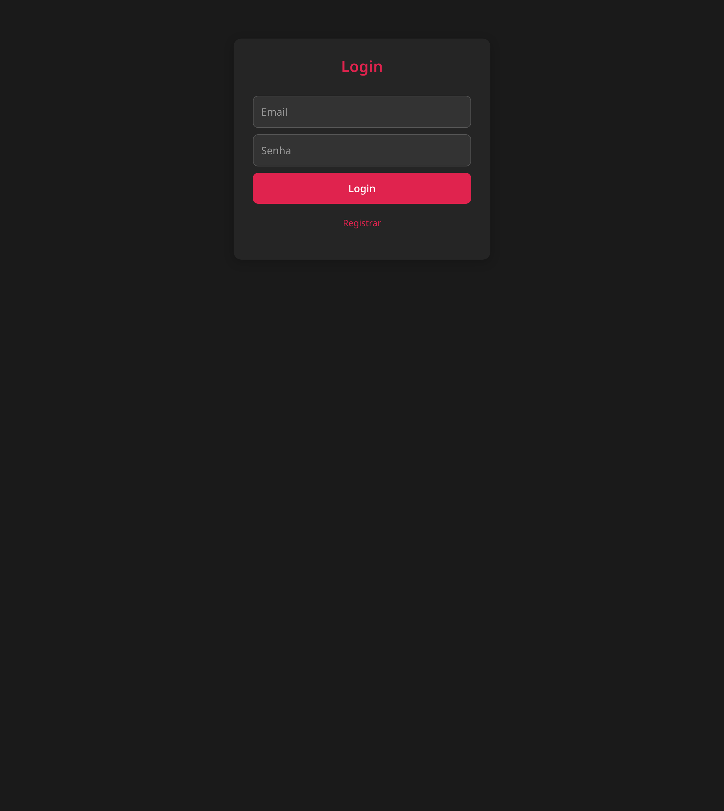
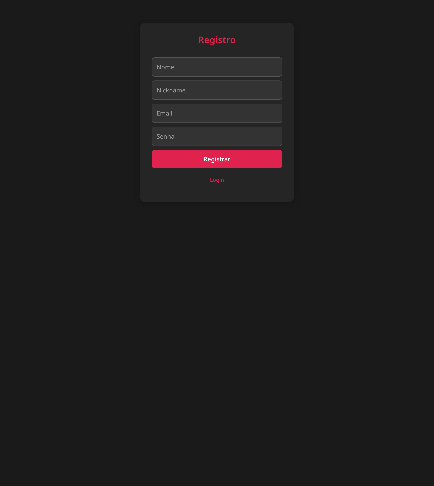
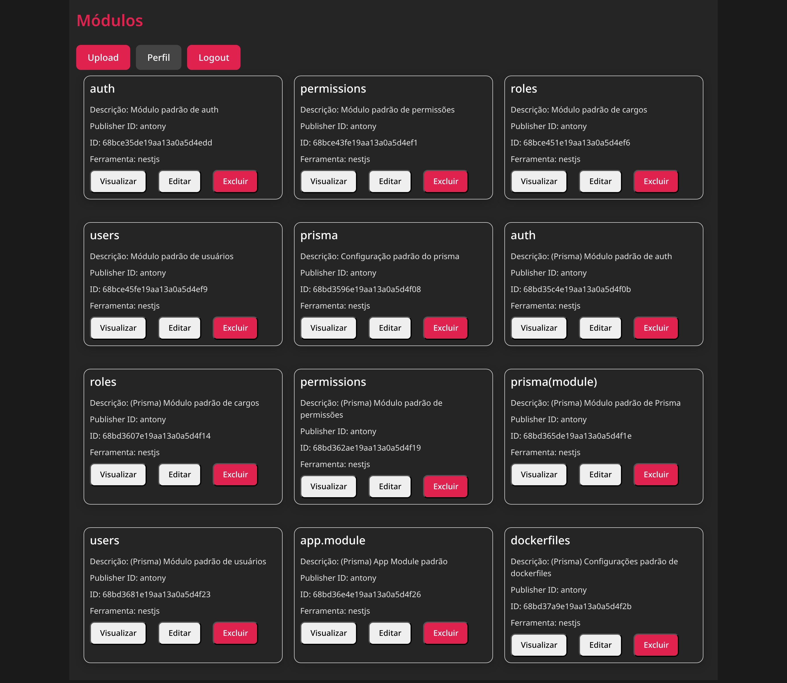

# Modula Web


**Modula Web** é uma interface web moderna e intuitiva para gerenciar módulos de software, construída com **React**, **Bootstrap**, e um tema escuro inspirado no NestJS. Permite aos usuários fazer login, registrar-se, visualizar módulos em um dashboard, inspecionar detalhes de módulos com uma estrutura de arquivos em formato de árvore, e copiar comandos de download para integração com a CLI do Modula.

## Índice

- [Funcionalidades](#funcionalidades)
- [Capturas de Tela](#capturas-de-tela)
- [Pré-requisitos](#pré-requisitos)
- [Instalação](#instalação)
- [Configuração](#configuração)
- [Executando o Projeto](#executando-o-projeto)
- [Estrutura do Projeto](#estrutura-do-projeto)
- [Funcionalidades Detalhadas](#funcionalidades-detalhadas)
- [Contribuindo](#contribuindo)
- [Licença](#licença)

## Funcionalidades

- **Autenticação Segura**: Login e registro com criptografia.
- **Dashboard Intuitivo**: Exibe módulos em um layout de grade, com opções para visualizar, editar, ou excluir.
- **Visualização de Módulos**: Modal detalhado com estrutura de arquivos em formato de árvore e comando de download para copiar (`$ modula download <id>`).
- **Tema Escuro**: Design elegante inspirado no NestJS.
- **Responsividade**: Interface adaptável para dispositivos móveis e desktop.

## Capturas de Tela

| Tela | Descrição |
|------|-----------|
|  | Formulário de login com suporte a "Enter". |
|  | Formulário de registro com campos para nome, nickname, email e senha. |
|  | Exibição de módulos em grade com botões de ação. |
|  | Detalhes do módulo com estrutura de arquivos e botão de cópia. |

## Pré-requisitos

- **Node.js** v18.x ou superior
- **npm** v8.x ou superior
- **Backend Modula**: API REST rodando (ex.: `http://10.8.0.2:3031`) com rotas `/auth/login`, `/auth/register`, e `/module/:id`.
- Navegador moderno (Chrome, Firefox, Edge)

## Instalação

1. Clone o repositório:
   ```bash
   git clone https://github.com/bethecozmo/modula-web.git
   cd modula-web
   ```

2. Instale as dependências:
   ```bash
   npm install
   ```
## Configuração

1. **Backend**:
   - Certifique-se de que o backend Modula está configurado e rodando na porta especificada (ex.: 3031).
   - Verifique as rotas:
     - `POST /auth/login`: Recebe `{ email, password }`, retorna `{ access_token }`.
     - `POST /auth/register`: Recebe `{ name, nickname, email, password }`.
     - `GET /module/:id`: Retorna detalhes do módulo, incluindo `nodes` com `type`, `name`, e `children`.

2. **Porta 80 (Opcional)**:
   Para rodar o backend na porta 80, use uma das opções:
   - **CAP_NET_BIND_SERVICE**:
     ```bash
     sudo setcap 'cap_net_bind_service=+ep' /usr/bin/node
     ```
   - **authbind**:
     ```bash
     sudo apt-get install authbind
     sudo touch /etc/authbind/byport/80
     sudo chown $USER /etc/authbind/byport/80
     sudo chmod 700 /etc/authbind/byport/80
     authbind --deep npm start
     ```
   - **Nginx (Recomendado)**: Configure um proxy reverso (veja [Configuração do Nginx](#configuração-do-nginx)).


## Executando o Projeto

1. Inicie o servidor de desenvolvimento:
   ```bash
   npm start
   ```

2. Acesse a aplicação em:
   ```
   http://localhost:3000
   ```

3. Faça login ou registre-se para acessar o dashboard.

## Estrutura do Projeto

```
modula-web/
├── public/
│   ├── index.html
│   └── screenshots/
│       ├── login.png
│       ├── register.png
│       ├── dashboard.png
│       └── view-modal.png
├── src/
│   ├── components/
│   │   ├── Dashboard.js
│   │   ├── Login.js
│   │   ├── Register.js
│   │   └── ViewModal.js
│   ├── utils/
│   │   └── api.js
│   └── index.css
├── .env
├── package.json
└── README.md
```

## Funcionalidades Detalhadas

- **Login (`src/components/Login.js`)**:
  - Formulário com campos de email e senha.
  - Suporte a envio via "Enter" ou clique no botão.
  - Integra com `/auth/login` e armazena `access_token` no `localStorage`.

- **Registro (`src/components/Register.js`)**:
  - Formulário com campos para nome, nickname, email e senha.
  - Suporte a envio via "Enter" ou clique no botão.
  - Integra com `/auth/register` e redireciona para `/login`.

- **Dashboard (`src/components/Dashboard.js`)**:
  - Exibe módulos em uma grade responsiva (2 por linha).
  - Botões para visualizar, editar, ou excluir módulos.

- **Visualização de Módulos (`src/components/ViewModal.js`)**:
  - Modal com detalhes do módulo (ID, descrição, ferramenta, caminho, publisher ID).
  - Estrutura de arquivos em formato de árvore (`├──`, `└──`, `│`).
  - Comando `$ modula download <id>` com botão de cópia (feedback "Copiado!" em verde).

- **Estilos (`src/index.css`)**:
  - Tema escuro com fundo `#1a1a1a`, botões `#e0234e`, e fontes monoespaçadas (`Consolas` para árvores de arquivos).
  - Layout responsivo com flexbox e bordas arredondadas.

## Configuração do Nginx (Produção)

Para rodar o backend na porta 80 com um proxy reverso:

1. Instale o Nginx:
   ```bash
   sudo apt-get install nginx
   ```

2. Crie `/etc/nginx/sites-available/modula`:
   ```nginx
   server {
       listen 80;
       server_name localhost;

       location / {
           proxy_pass http://localhost:3031;
           proxy_set_header Host $host;
           proxy_set_header X-Real-IP $remote_addr;
           proxy_set_header X-Forwarded-For $proxy_add_x_forwarded_for;
           proxy_set_header X-Forwarded-Proto $scheme;
       }
   }
   ```

3. Habilite e reinicie:
   ```bash
   sudo ln -s /etc/nginx/sites-available/modula /etc/nginx/sites-enabled/
   sudo nginx -t
   sudo systemctl restart nginx
   ```

## Contribuindo

1. Fork o repositório.
2. Crie uma branch:
   ```bash
   git checkout -b minha-nova-funcionalidade
   ```
3. Commit suas mudanças:
   ```bash
   git commit -m "Adiciona minha nova funcionalidade"
   ```
4. Envie para o repositório remoto:
   ```bash
   git push origin minha-nova-funcionalidade
   ```
5. Abra um Pull Request.

## Licença

Este projeto está licenciado sob a [Licença MIT](LICENSE).